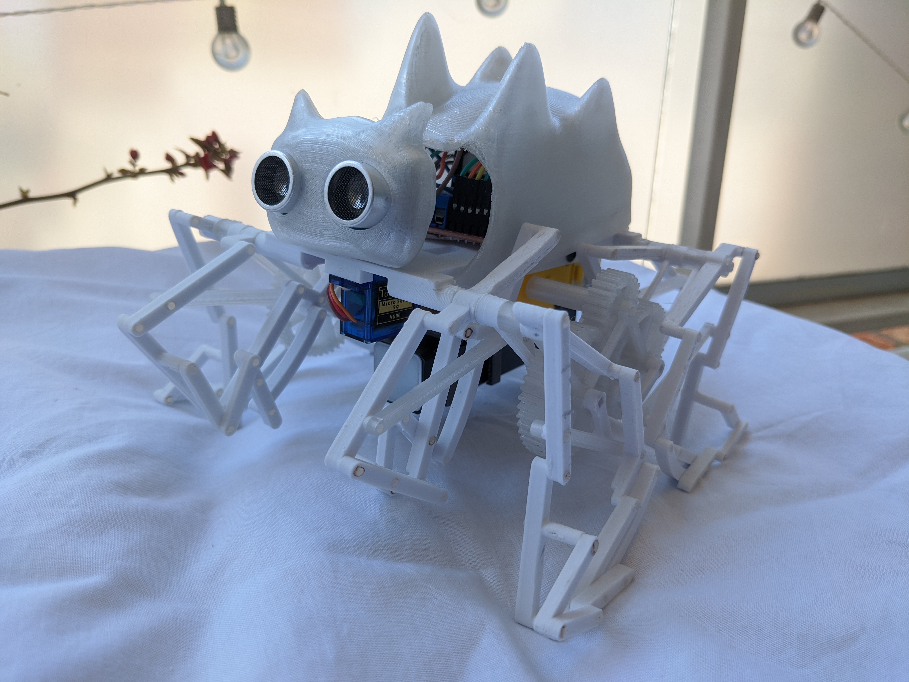
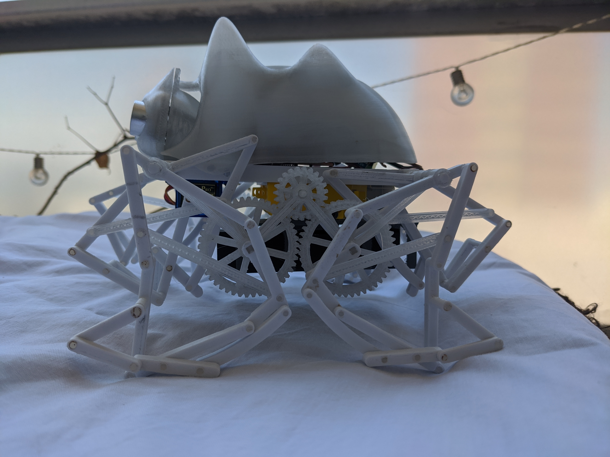

# WalkingBot-V2
WalkingBot-V2 is an open source 3D printed robot that walks!
This repository contains all the software, 3D models and BOM to make the full assembly.

## About
I think my strongest motivation for building walking mechanisms arised after discovering the marvelous [strandbeests by Theo Jansen][1].
After doing some further research on the topic, I found some other mechanimsms with different walking profiles. The one that caught my attention the most was the [trotbot][2], so I based my design on it, adding just some small modifications to the linkage structure.

## Hardware
The following table lists the BOM:

|Parts                         | Quantity | 
|------------------------------|----------|
| [NodeMCU board][3]           |    1     |
| [L298 N H-Bridge driver][4]  |    1     |
| [18650 battery holder][5]    |    1     |
| [18650 batteries][6]         |    2     |
| [BMS 2S battery charger][7]  |    1     |
| [cables and connectors][11]  |    2     |
| [ultrasound sensor][8]       |    1     |
| [dc motors with gearbox][9]  |    2     |
| [SG90 Servo 180 degrees][10] |    1 	   |
| M3x25 bolts                  |    4 	   |
| M3x12 bolts                  |    2 	   |
| M3 nuts                      |    4 	   |
 
 To see the circuit diagram [click here!](docs/circuit_diagram.md)
 
 ## 3D printed parts and assembly
 STL files can be found under [parts/STL](parts/STL).
 
 The parts were designed using Autodesk Inventor. CAD files and full assemblies can be found under [parts/CAD](parts/CAD).
 
 To see the assembly instructions [click here!](docs/assembly.md)
 
 ## Software
 The robot can be controlled throw Wi-Fi using MQTT messages. For this project we see how to control it with a joystick on an Android App called [Remote XY][12].
 
 The software in this repository includes:
  - Firmware: Arduino sketch for the NodeMCU board.
  - Node-RED flow: a server in charge of communicating the joystick in the phone with the robot.

 To see a guide for setting up the software [click here!](docs/software.md)
 
 ## Videos
 https://youtu.be/vDro2LflieM

 https://youtu.be/8G8XOwB4iCY

 https://youtu.be/JpEi38m9lwI
  
 ## Authors

- [Agustin Devitturi](https://github.com/adevitturi)

[1]: https://www.strandbeest.com/
[2]: https://www.diywalkers.com/trotbot-linkage-plans.html
[3]: https://www.amazon.com/KeeYees-Internet-Development-Wireless-Compatible/dp/B07PR9T5R5/ref=sr_1_7?dchild=1&keywords=nodemcu&qid=1611461258&sr=8-7 "NodeMcu"
[4]: https://www.amazon.com/L298N-H-Bridge-Stepper-Module-Arduino/dp/B07D2BTMPK/ref=sr_1_7?dchild=1&keywords=l298n&qid=1611461230&sr=8-7 "L298 Driver"
[5]: https://www.amazon.com/HTTX-Battery-Holder-2-Slot-Storage/dp/B07DBLY3WS/ref=sr_1_12?dchild=1&keywords=18650+battery+holder&qid=1611461318&sr=8-12 "Battery holder"
[6]: https://www.ebay.com/itm/SAMSUNG-ICR-22P-SDI-2-GN1T-RECHARGEABLE-BATTERIE-3-6V-2150mAh-Li-Ion-NEU/143293064204?_trkparms=ispr%3D1&hash=item215ceea40c:g:ZUQAAOSwoz9dAhCa&amdata=enc%3AAQAFAAACcBaobrjLl8XobRIiIML1V4Imu%252Fn%252BzU5L90Z278x5ickk7d4nremBkvNKtcC0ZwqXDHkXsYhJQTdihFAnAnx3hqAK6IrjDgj4AwVKv%252BpjJ4wuEavXcMKc7tY3pZzgPKxWTGVSFv4I1R1xTqQxwxvR4Qq6Ei%252Bs9rnUGNzmCdwlbiNLcTP8t1f%252Ff5FCjqiZqcg6fMp7tGAjeFA37z8h83UlhdihnBFZTMf%252B9PhHdMCqiKD12a2SCw4dM8gBIaksgK3aOT4A4mYrcnteq%252BDwlK6uJydwFO50SazfUTp83K3s1Q3lTXZzkz57uHGstQk6WUzmZNbQQAFNrG03O2LprEb0hXID0QjAKi4ABnXg0TCr0VTMrCUEtBcU9%252BxSdTqqFKCm%252FAKEvlDGlKJKxOUGPLgScFQGNtI1I5EqihNt5Q3xeXAIA%252BWjI3pcj00nZXgyCeLpw0lM13KRNY6rLOVTycqGbFaktHx%252BNvk9DLcN4swmGSJW3QzZNESk%252Fu%252FFFNLhYx5Z6yVPYjKrEGX1l3QPHwiwAyFV%252FX0aMkJSsLCJr5r0y%252FLkCwXHwzI2LvOA6JFLGmJuebbNiGwZHLmKYO9GW50WFCzXOfI3jvQjDS3kmzI6efevHPm%252Bvj2wjRZRz%252BEkNdqpWDDvx9LgOf0cr6Ajph7Qu2KTGWNOytd8%252FKdXhNlnv9P5xSxXw0ziOS%252Fg9PrjDaKDRb7qTrP4SNmIpbRQHsqXaSyIE1AglHajGzTf%252Fcelm5Lo%252B5Fi%252BSHLeD4x3hTq9VnlzwChHz%252FQ6UBsMpV6xs1L2I2%252B2TxCNDetYz9cprIz0Xb3BP2psb3EjugWbgHuiM4yeQ%253D%253D%7Ccksum%3A1432930642044af6bc373e8f402cb509933a8c566512%7Campid%3APL_CLK%7Cclp%3A2334524 "18650 batteries"
[7]: https://www.amazon.com/-/es/Li-ion-Bater%C3%ADa-Cargador-Protecci%C3%B3n-Sobrecarga/dp/B07GX2VTXC/ref=sr_1_5?__mk_es_US=%C3%85M%C3%85%C5%BD%C3%95%C3%91&dchild=1&keywords=bms+2s&qid=1611614895&sr=8-5 "BMS 2S"
[8]: https://www.amazon.com/UIOTEC-Operating-HC-SR04-P-Ultrasound-Ultrasonic/dp/B07DWWTT3F/ref=sr_1_8?dchild=1&keywords=ultrasound+arduino&qid=1611461527&sr=8-8 "Ultrasound sensor"
[9]: https://www.amazon.com/AutoEC-4pcs-Motor-Smart-Robot/dp/B00U4HP0SQ/ref=sr_1_39?dchild=1&keywords=arduino+dc+motor&qid=1611461562&sr=8-39
[10]: https://www.amazon.com/SunFounder-Digital-Helicopter-Airplane-Controls/dp/B01M5LIKLQ/ref=sr_1_18?dchild=1&keywords=tower+pro+sg90&qid=1611461723&sr=8-18 "Servo"
[11]:https://www.amazon.com/-/es/10-pares-Connector-Battery-discharge-alambre/dp/B01JUDP5NY/ref=sr_1_17?__mk_es_US=%C3%85M%C3%85%C5%BD%C3%95%C3%91&dchild=1&keywords=battery+connector&qid=1611615490&sr=8-17 "Battery connector"
[12]:https://play.google.com/store/apps/details?id=com.shevauto.remotexy.free&hl=es&gl=US
