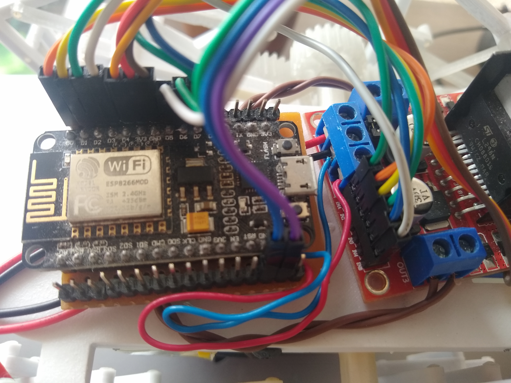
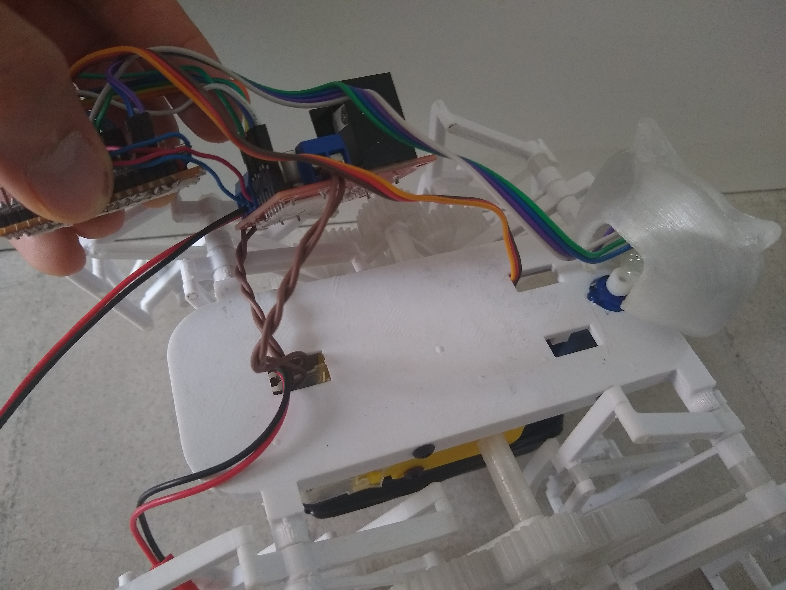

## Circuit diagram

You can see the whole diagram in the picture below. Or access the image under [images/circuit/circuit_diagram.png](../images/circuit/circuit_diagram.png).

To connect all the wires that come out from the NodeMcu you can assemble a small development board with some extra male header pins to make it easier, but you can choose the way that is easier to you.
In the following picture you can see an example board with some extra header pins to connect some dupont cables.

You will notice that to make the connections in the robot head there is a hole where you can connect some duppont cables.

To connect the motors, the servo and the batteries, you will notice there are some square holes in the robot chasis from where you can pull the cables from the other side.

